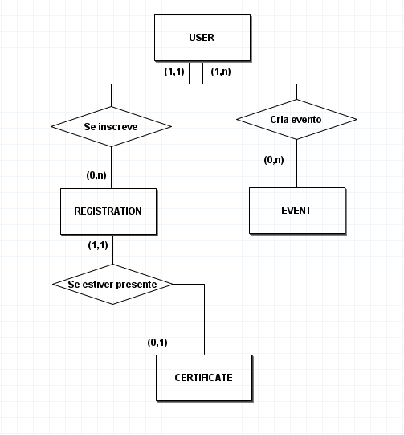
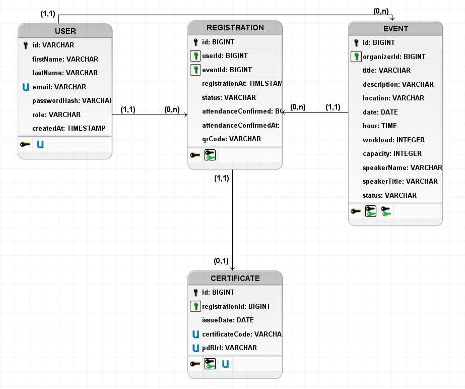

# ValidAI - Sistema de Gerenciamento e Emissão de Certificados

# Contexto do Problema

#### **Objetivo:** Desenvolver uma API RESTful em Java (Spring Boot) para gerenciamento de eventos e emissão de certificados, focando em boas práticas, arquitetura em camadas e banco de dados relacional.

#### **Problema:** Instituições gerenciam inscrições, presença e emissão de certificados manualmente por planilhas e formulários básicos. Isso gera retrabalho, erros e falta de rastreabilidade.

#### **Solução:** Sistema de gerenciamento de eventos para instituições, no qual será possível cadastrar eventos, gerenciar inscritos, confirmar presença via QR Code e emitir certificados.

- Cadastro de usuários (participantes, organizadores e administradores).
- Criação e gerenciamento de eventos.
- Inscrição de participantes em eventos.
- Validação de presença por QR Code.
- Emissão de certificados para participantes com presença confirmada.

# Requisitos e Regras de Negócio

## 1. Perfis de Usuário

| Perfil | Descrição |
|---|---|
| Admin | Gerencia usuários, eventos e permissões gerais do sistema. |
| Organizador | Cria eventos, gerencia inscritos e valida presença. |
| Participante | Visualiza eventos disponíveis, realiza inscrição e recebe certificados. |

## 2. Regras de Negócio (Mínimo 10)

1. [RN01] - **User:** para se inscrever em um evento, é necessário estar cadastrado no sistema.
2. [RN02] - **User:** para se cadastrar no sistema, são obrigatórios nome, sobrenome, e-mail e senha.
3. [RN03] - **User:** só pode existir um usuário por e-mail.
4. [RN04] - **Registration:** um usuário não pode se inscrever duas vezes no mesmo evento.
5. [RN05] - **Certificate:** um participante só recebe certificado caso sua presença seja confirmada por organizador ou admin.
6. [RN06] - **Event:** apenas admins e organizadores podem criar eventos.
7. [RN07] - **Event:** título, descrição, local, número de vagas, data, hora, carga horária, palestrante e cargo/título do palestrante são obrigatórios.
8. [RN08] - **Event:** um evento deve ser cadastrado para, no mínimo, o dia seguinte ao cadastro.
9. [RN09] - **Event:** evento cancelado não permite novas inscrições. A notificação de inscritos é uma evolução futura, pois não há serviço de e-mail nesta entrega.
10. [RN10] - **Event:** evento só pode ser editado ou cancelado pelo organizador que o criou ou por admin.
11. [RN11] - **Registration:** inscrições ativas não podem exceder a capacidade do evento.
12. [RN12] - **Certificate:** a data de emissão é a data em que o certificado é emitido pelo sistema.
13. [RN13] - **Registration:** usuário pode cancelar somente a própria inscrição e apenas antes de o evento ocorrer.

## 3. Entidades do Sistema

| Entidade | Campos principais | Restrições relevantes |
|---|---|---|
| `users` | id, firstName, lastName, email, passwordHash, role, createdAt | `email` único; senha armazenada somente como hash; `role` em `ADMIN`, `ORGANIZER`, `PARTICIPANT`. |
| `events` | id, organizerId, title, description, location, date, hour, workload, capacity, speakerName, speakerTitle, status | `organizerId` é FK para `users`; capacidade e carga horária são positivas; `status` em `ACTIVE`, `CANCELED`, `FINISHED`. |
| `registrations` | id, userId, eventId, registrationAt, status, attendanceConfirmed, attendanceConfirmedAt, qrCode | FKs para `users` e `events`; `UNIQUE(userId, eventId)`; `qrCode` único; `status` em `ACTIVE`, `CANCELED`, `ATTENDED`. |
| `certificates` | id, registrationId, issueDate, certificateCode, pdfUrl | `registrationId` único e FK para `registrations`; `certificateCode` e `pdfUrl` únicos. |

Cardinalidades: um usuário possui muitas inscrições; um evento possui muitas inscrições; uma inscrição possui zero ou um certificado; um usuário organiza muitos eventos.

**Justificativa:** essas entidades cobrem o ciclo completo: usuários se cadastram, eventos são criados, participantes se inscrevem, organizadores validam presenças e certificados são emitidos com base nas inscrições.

## Requisitos Funcionais

1. [RF01] Um usuário deve conseguir se cadastrar.
2. [RF02] Um organizador ou admin deve conseguir cadastrar um evento.
3. [RF03] O sistema deve confirmar a presença de participante validada via QR Code.
4. [RF04] Um usuário deve conseguir listar eventos e filtrar por status.
5. [RF05] Um usuário autenticado deve conseguir se inscrever em evento ativo com vagas disponíveis.
6. [RF06] Um participante deve conseguir cancelar sua própria inscrição antes do evento.
7. [RF07] Organizador proprietário ou admin deve conseguir editar e cancelar evento.
8. [RF08] O sistema deve gerar um token QR Code único ao criar uma inscrição.
9. [RF09] O sistema deve emitir um certificado único para inscrição com presença confirmada.
10. [RF10] Um usuário autorizado deve conseguir baixar o PDF de um certificado.
11. [RF11] Um admin deve conseguir listar usuários e alterar seus papéis.

## Requisitos Não Funcionais

1. [RNF01] A API deve usar Java 21, Spring Boot 4.1.0, Gradle e PostgreSQL 16.
2. [RNF02] Entradas devem ser validadas e erros devem seguir um formato JSON padronizado.
3. [RNF03] O banco deve ser criado e evoluído por migrations Flyway versionadas.
4. [RNF04] Senhas devem ser persistidas somente como hash; JWT será implementado na unidade seguinte.
5. [RNF05] A API deve expor documentação OpenAPI/Swagger para endpoints implementados.
6. [RNF06] Regras de negócio devem ficar em services; controllers devem apenas tratar HTTP.
7. [RNF07] Tokens de QR Code e códigos de certificado devem ser únicos e não sequenciais.

## Modelagem Conceitual

## Modelagem Lógica - DER

## Dicionário de Dados

| Entidade | Campo | Tipo | Obrigatório | Regra |
| -------- | ----- | ---- | --- | ----- |
| USER | id | BIGINT | SIM | PK |
| USER | firstName | VARCHAR(50) | SIM | Mínimo 3 caracteres |
| USER | lastName | VARCHAR(50) | SIM | Mínimo 3 caracteres |
| USER | email | VARCHAR(255) | SIM | UNIQUE; formato de e-mail válido |
| USER | passwordHash | VARCHAR(255) | SIM | Armazenar somente hash BCrypt |
| USER | role | VARCHAR(12) | SIM | Valores: `PARTICIPANT`, `ORGANIZER`, `ADMIN` |
| USER | createdAt | TIMESTAMP | SIM | Data e hora do cadastro |
| EVENT | id | BIGINT | SIM | PK |
| EVENT | organizerId | BIGINT | SIM | FK para USER(id) |
| EVENT | title | VARCHAR(255) | SIM | Mínimo 5 caracteres |
| EVENT | description | VARCHAR(255) | SIM | Mínimo 10 caracteres |
| EVENT | location | VARCHAR(255) | SIM | Mínimo 10 caracteres |
| EVENT | date | DATE | SIM | A partir do dia seguinte |
| EVENT | hour | TIME | SIM | Horário do evento |
| EVENT | workload | INTEGER | SIM | Inteiro positivo; carga horária em horas |
| EVENT | capacity | INTEGER | SIM | Inteiro positivo; quantidade máxima de participantes |
| EVENT | speakerName | VARCHAR(50) | SIM | Mínimo 3 caracteres |
| EVENT | speakerTitle | VARCHAR(50) | SIM | Mínimo 3 caracteres |
| EVENT | status | VARCHAR(8) | SIM | Valores: `ACTIVE`, `CANCELED`, `FINISHED` |
| REGISTRATION | id | BIGINT | SIM | PK |
| REGISTRATION | userId | BIGINT | SIM | FK para USER(id) |
| REGISTRATION | eventId | BIGINT | SIM | FK para EVENT(id) |
| REGISTRATION | (userId, eventId) | COMPOSITE UNIQUE | SIM | Impede duas inscrições do mesmo usuário no evento |
| REGISTRATION | registrationAt | TIMESTAMP | SIM | Data e hora da inscrição |
| REGISTRATION | status | VARCHAR(8) | SIM | Valores: `ACTIVE`, `CANCELED`, `ATTENDED` |
| REGISTRATION | attendanceConfirmed | BOOLEAN | SIM | `false` na criação; `true` após check-in |
| REGISTRATION | attendanceConfirmedAt | TIMESTAMP | NÃO | Data e hora da confirmação de presença |
| REGISTRATION | qrCode | VARCHAR(255) | SIM | UNIQUE; token opaco aleatório da inscrição |
| CERTIFICATE | id | BIGINT | SIM | PK |
| CERTIFICATE | registrationId | BIGINT | SIM | FK para REGISTRATION(id); UNIQUE (relação 1:1) |
| CERTIFICATE | issueDate | DATE | SIM | Data atual da emissão |
| CERTIFICATE | certificateCode | VARCHAR(255) | SIM | UNIQUE; código de validação do certificado |
| CERTIFICATE | pdfUrl | VARCHAR(255) | SIM | UNIQUE; caminho/URL do PDF gerado |

## Matriz de Permissões

| Operação | PARTICIPANT | ORGANIZER | ADMIN |
|---|:---:|:---:|:---:|
| Listar eventos | ✓ | ✓ | ✓ |
| Criar evento | — | ✓ | ✓ |
| Editar/cancelar evento próprio | — | ✓ | ✓ |
| Editar/cancelar evento de terceiro | — | — | ✓ |
| Inscrever-se e cancelar inscrição própria | ✓ | ✓ | ✓ |
| Consultar inscrições próprias | ✓ | ✓ | ✓ |
| Confirmar presença em evento próprio | — | ✓ | ✓ |
| Emitir certificado de evento próprio | — | ✓ | ✓ |
| Baixar certificado próprio | ✓ | ✓ | ✓ |
| Listar usuários e alterar papéis | — | — | ✓ |

**Observação:** a matriz define o comportamento definitivo. A proteção com Spring Security/JWT será implementada após a 1AV.

## Backlog e Critérios de Aceite

| ID | História de usuário | Critério de aceite |
|---|---|---|
| US01 | Como visitante, quero me cadastrar para acessar o sistema. | Dados válidos criam participante; e-mail repetido retorna conflito; senha não é devolvida. |
| US02 | Como usuário, quero realizar login. | Credenciais inválidas retornam 401; JWT será entregue na próxima unidade. |
| US03 | Como participante, quero listar eventos. | Lista pode ser vazia; filtro válido funciona; filtro inválido retorna 400. |
| US04 | Como organizador, quero criar e editar evento. | Campos obrigatórios e data futura são validados; apenas proprietário/admin altera. |
| US05 | Como organizador, quero cancelar evento. | Status muda para `CANCELED` e novas inscrições são bloqueadas. |
| US06 | Como participante, quero me inscrever. | Inscrição gera token QR; duplicidade retorna 409; capacidade é respeitada. |
| US07 | Como participante, quero cancelar inscrição. | Somente o titular cancela antes do evento e o status muda para `CANCELED`. |
| US08 | Como organizador, quero confirmar presença por QR. | Token de inscrição ativa do evento muda status para `ATTENDED` e registra data/hora. |
| US09 | Como autorizado, quero emitir certificado. | Apenas inscrição atendida recebe um certificado; segunda emissão retorna 409. |
| US10 | Como admin, quero administrar usuários. | Admin lista usuários e altera papel válido; usuário inexistente retorna 404. |

## Entrega Final da 1AV

Conforme `instruct.md`, a apresentação de 05/10/2026 deve demonstrar:

| Item obrigatório | Peso | Situação documental atual |
|---|:---:|---|
| Requisitos funcionais e não funcionais | 1,0 | Concluído neste documento |
| Regras de negócio | 1,0 | Concluído neste documento |
| DER e dicionário de dados | 1,5 | Concluído neste documento e em `assets/` |
| Rotas, contratos e status codes | 1,5 | Consolidado em `contratos-api.md` |
| Arquitetura e estrutura do projeto | 1,0 | Consolidado em `arquitetura.md` |
| Matriz de permissões | 1,0 | Concluída neste documento |
| Backlog e critérios de aceite | 1,0 | Concluído neste documento |
| Swagger/API inicial funcionando | 1,0 | Pendente para Checkpoint 3 |
| Organização no GitHub | 1,0 | Já existente; manter atualizada |
| Apresentação e defesa técnica | 1,0 | Pendente; preparar após MVP técnico |
